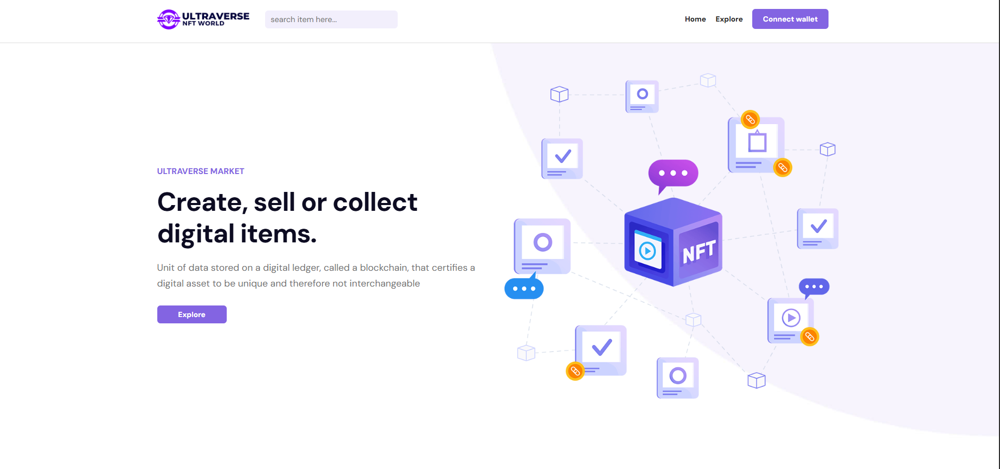
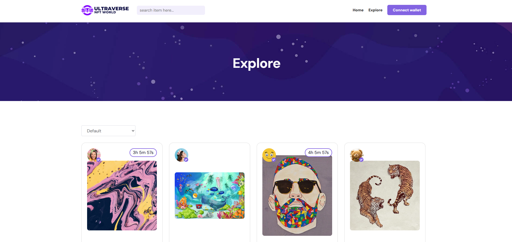
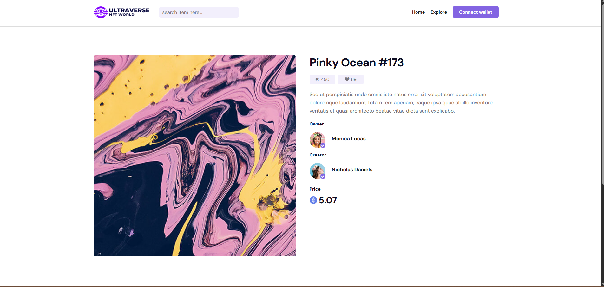

# Ultraverse

An NFT marketplace UI rebuilt from a static template into a data-driven React app. Every collection, item, and seller loads from a live API, with skeleton loading states, carousels, sorting, and live auction countdowns.

**[Live site →](https://nft-market-ten-omega.vercel.app/)**

## The problem

Turn a static marketplace template with hard-coded content into a working app that loads everything from an API, handles loading states cleanly, and routes to a page for every item and author.

## My contribution

Solo build, as part of Frontend Simplified's frontend program.

- Replaced hard-coded content with live data fetched through Axios on the home, Explore, author, and item pages
- Carousels for Hot Collections and New Items
- Skeleton loaders for every data-driven section
- Dynamic item and author pages with React Router
- Live countdown timers on items with an auction end time
- Sorting on the Explore page (price and most liked) with a "Load more" button
- A follow button on author profiles that updates the follower count
- Scroll-triggered animations with AOS

## Tech stack

React, React Router, Axios, Owl Carousel, AOS (Animate On Scroll), Bootstrap, deployed on Vercel

## Screenshots





## Technical decisions

### Skeletons shaped like the real content
Instead of a generic spinner, each section shows placeholders that match its final layout: round avatars, card-sized tiles, and text-width lines. The page keeps its shape while data loads, so nothing jumps when the API responds. That avoids layout shift, one of Google's Core Web Vitals.

### Sorting on the server, "Load more" on the client
Changing the sort option requests a freshly sorted list from the API with a `filter` parameter, so results are always sorted across the full dataset. "Load more" just reveals more of the items already fetched, with no extra network request.

### A self-cleaning countdown timer
Each timer calculates its first value immediately (so it never flashes blank), updates once per second, and clears its interval when the component unmounts or the end time changes. Expired items show "Expired" instead of negative numbers.

## Accessibility and testing

- Links and buttons use semantic elements, and routes have real URLs, so browser back and forward work as expected
- Tested loading, sorting, "Load more," and navigation between items and authors against the live API
- **Known gaps:** much of the template's imagery has empty `alt` text, and the carousels come from a jQuery-era library with limited keyboard support. Replacing it with an accessible carousel would be the next improvement.
- **No automated test suite yet.**

## Setup

```bash
git clone https://github.com/brenthippler-art/nft-market.git
cd nft-market
npm install
npm start
```

The app runs at http://localhost:3000. No environment variables are needed.

Image credits are listed in [image-credits.txt](./image-credits.txt).

## Live link

[nft-market-ten-omega.vercel.app](https://nft-market-ten-omega.vercel.app/)

## Author

**Brenton Hippler:** [Portfolio](https://brentoncodes.dev) · [LinkedIn](https://www.linkedin.com/in/brenton-hippler-818b6397) · [GitHub](https://github.com/brenthippler-art)